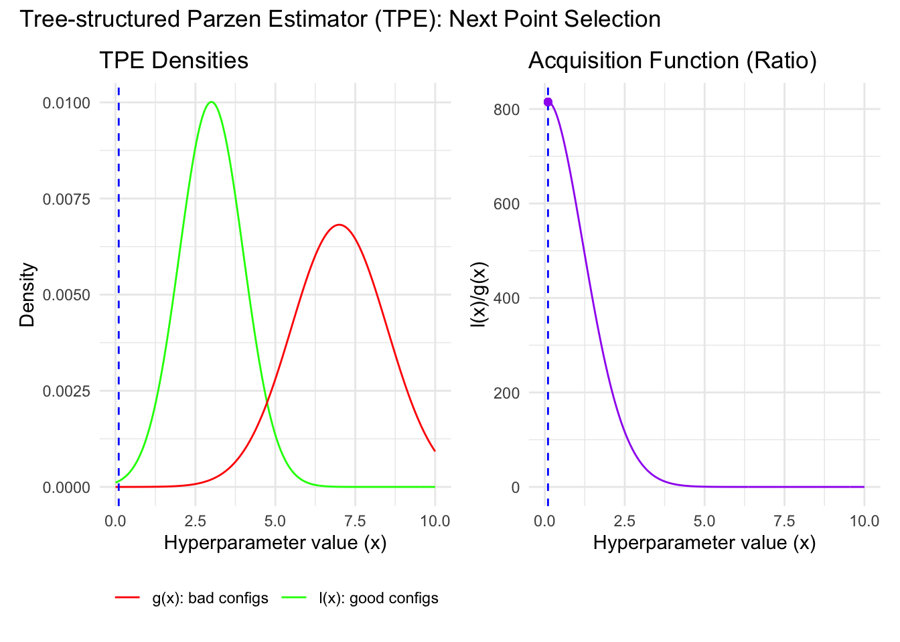

# Advanced Hyperparameter Optimization {#sec-hpo}

## Overview

Hyperparameter optimization (HPO) is the problem of choosing settings that control how a model is estimated. Unlike fitted parameters, these settings are not obtained directly by minimizing the model's training loss. Examples include the penalty strength in ridge or lasso, tree depth and minimum leaf size, the number of trees in a forest, the learning rate in boosting, or the batch size and network width in a neural network.

For econometricians, HPO matters for two reasons. First, predictive performance can change materially across plausible settings. Second, the act of searching itself creates a statistical problem: if we try many specifications and keep the one with the best validation score, we are optimizing a noisy estimate of out-of-sample performance. Without a disciplined workflow, the selected model can look much better in validation than it will look in truly new data.

This chapter extends the basic validation ideas from the [Cross Validation chapter](cross_validation.qmd), especially the discussions of [Reliable Workflow: Validation vs Test Set](cross_validation.qmd#sec-cv-reliable-workflow), [Leakage Inside Cross-Validation](cross_validation.qmd#sec-cv-leakage), [K-Fold Cross-Validation](cross_validation.qmd#sec-cv-kfold), and [Time Series Cross-Validation](cross_validation.qmd#sec-cv-time-series). The goal here is not to repeat that chapter in full, but to show how those ideas change once hyperparameters themselves become the optimization target.

:::{.callout-note title="Definition: Parameters vs Hyperparameters"}

**Parameters** are fitted from the training loss once the model class is fixed, such as regression coefficients or tree leaf values.

**Hyperparameters** are researcher-chosen settings that govern model complexity, regularization, optimization, or resampling design, such as a penalty parameter, tree depth, learning rate, number of trees, or window length.
:::

## Roadmap

1. We begin with why reliable HPO is statistically harder than fitting one fixed model.
2. We then discuss how dependent data, overlapping targets, and preprocessing choices complicate HPO in econometric applications.
3. Next we formalize HPO as the optimization of a noisy validation objective over a search space.
4. We compare baseline search methods, Bayesian optimization, and multi-fidelity methods, which compare configurations using cheap partial training runs before committing the full budget. Hyperband is the main example.
5. Finally, we summarize a practical workflow for choosing and validating tuning strategies in econometric work.

## Why Reliable HPO Is Hard

Suppose the true generalization error of a configuration $\lambda$ is $c(\lambda)$. We do not observe $c(\lambda)$ directly. We observe a noisy estimate from a validation split, cross-validation scheme, or rolling forecast exercise. If we evaluate many configurations and pick the one with the lowest estimated error, the winner is selected partly because of genuine quality and partly because of favorable noise in the estimate.

The clean separation between training, validation, and test data from [Reliable Workflow: Validation vs Test Set](cross_validation.qmd#sec-cv-reliable-workflow) therefore becomes even more important in HPO. Training data estimate model parameters. Validation data compare hyperparameter settings. Test data remain untouched until the search procedure is finished.

The danger is easy to miss. Even a small comparison can favor a configuration whose validation noise happened to be favorable; a larger search creates more opportunities for this to occur. Once the same validation design is used to compare settings, its score becomes an optimization target. The minimum validation score across many trials is then usually optimistic. This is the hyperparameter version of specification search [@CawleyTalbot2010; @VarmaSimon2006].

:::{.callout-note title="Selection Bias from Search"}

Suppose configuration $j$ has true risk $c_j$ and validation estimate

$$
\hat c_j = c_j + \varepsilon_j,
\qquad
\mathbb{E}[\varepsilon_j] = 0.
$$

Even if each $\hat c_j$ is unbiased for $c_j$ when considered separately, the selected score

$$
\min_{1 \le j \le J} \hat c_j
$$

is typically optimistically biased as an estimate of the true risk of the selected configuration. Formally,

$$
\mathbb{E}\left[\min_{1 \le j \le J} \hat c_j\right]
\le
\min_{1 \le j \le J} \mathbb{E}[\hat c_j]
=
\min_{1 \le j \le J} c_j.
$$

The inequality is strict unless the same configuration always wins.

This display compares the winning score with the best *true* risk in the grid. The claim we actually care about concerns the configuration the search selects, $\hat\jmath = \arg\min_j \hat c_j$, whose true risk $c_{\hat\jmath}$ is itself random because the winner is random. The bridge is one further inequality: since $c_{\hat\jmath} \ge \min_j c_j$ by definition of a minimum, taking expectations gives $\mathbb{E}[c_{\hat\jmath}] \ge \min_j c_j$. Chaining the two,

$$
\mathbb{E}\Big[\min_{1\le j\le J}\hat c_j\Big]
\;\le\;
\min_{1\le j\le J} c_j
\;\le\;
\mathbb{E}\big[c_{\hat\jmath}\big],
$$

and since the left-hand side is exactly the reported validation score of the selected configuration, $\hat c_{\hat\jmath}$, the winning validation number is downward-biased for the true risk of the very model it selects. After search, that score is partly low because the model is good and partly low because its realized validation noise was favorable.
:::

The same logic is visible in @fig-hpo-selection-bias. The selected configuration is the one with the lowest realized validation loss, but its blue point, which represents true risk, sits above the red validation point. The figure should be read as a visualization of selection-induced optimism, not as a claim about one particular algorithm.

```{python}
#| label: fig-hpo-selection-bias
#| fig-cap: "Illustration of selection bias from hyperparameter search. The horizontal axis indexes 20 candidate configurations. The blue line shows each configuration's true risk, the red line shows a noisy validation estimate, and the dashed vertical line marks the configuration selected by minimizing validation loss. For the selected configuration, the realized validation loss lies below the true risk, illustrating how search can make the winner look too good."
#| echo: true

import numpy as np
import matplotlib.pyplot as plt

rng = np.random.default_rng(14)
n_cfg = 20
cfg = np.arange(1, n_cfg + 1)

true_risk = 0.56 + 0.02 * np.sin(cfg / 3) + 0.012 * np.log1p(cfg)
true_risk[6] -= 0.04
true_risk[12] -= 0.02
validation_risk = true_risk + rng.normal(0.0, 0.035, n_cfg)

best_idx = np.argmin(validation_risk)

fig, ax = plt.subplots(figsize=(9, 4.8))
ax.plot(cfg, true_risk, marker="o", linewidth=2, color="C0", label="True risk")
ax.plot(cfg, validation_risk, marker="s", linewidth=1.6, color="C3", alpha=0.8, label="Validation estimate")
ax.axvline(cfg[best_idx], linestyle="--", color="0.4", linewidth=1.4)
ax.scatter(cfg[best_idx], validation_risk[best_idx], s=95, color="C3", zorder=3)
ax.scatter(cfg[best_idx], true_risk[best_idx], s=95, color="C0", zorder=3)
ax.annotate(
    "Selected by validation",
    xy=(cfg[best_idx], validation_risk[best_idx]),
    xytext=(cfg[best_idx] + 1.2, validation_risk[best_idx] - 0.055),
    arrowprops={"arrowstyle": "->", "color": "0.25"},
    fontsize=10,
)
ax.annotate(
    "True risk of selected configuration",
    xy=(cfg[best_idx], true_risk[best_idx]),
    xytext=(cfg[best_idx] + 1.2, true_risk[best_idx] + 0.03),
    arrowprops={"arrowstyle": "->", "color": "0.25"},
    fontsize=10,
)
ax.set_xlabel("Hyperparameter configuration")
ax.set_ylabel("Loss")
ax.set_title("Selection Bias from Searching Many Configurations")
ax.grid(True, alpha=0.25)
ax.legend(frameon=False, loc="upper left")
plt.tight_layout()
plt.show()
```

Nested resampling is the clean benchmark when we want a reliable assessment of the entire tuning procedure.

- The **inner loop** tunes hyperparameters.
- The **outer loop** estimates the out-of-sample performance of the tuned procedure.
- The outer validation blocks must remain untouched by the inner search.

When observations can reasonably be treated as independent and identically distributed (i.i.d.), the inner and outer loops can use the $K$-fold design reviewed in [K-Fold Cross-Validation](cross_validation.qmd#sec-cv-kfold). In dependent-data settings, the same logic applies but the folds must be time-aware. The important point is conceptual: the object being evaluated is not one model, but the whole pipeline "fit, tune, select, refit."

@fig-hpo-nested-time-series gives a time-series version of this logic. The outer split determines where reliable evaluation occurs. Inside the outer training window, the researcher runs a second, time-aware tuning exercise. Only after the inner loop selects hyperparameters is the model refit on the full outer training sample and evaluated once on the untouched outer validation block.

```{python}
#| label: fig-hpo-nested-time-series
#| fig-cap: "Schematic of nested time-series hyperparameter tuning. The top row shows one outer split: an outer training window followed by an untouched outer validation block used only for final evaluation of the tuned procedure. The lower rows show two inner expanding-window folds constructed only inside the outer training window. In each inner fold, the left block is the inner training sample and the right block is the inner validation block used to compare hyperparameter configurations. After tuning, the selected configuration is refit on the full outer training window and then evaluated once on the outer validation block."
#| echo: true

import matplotlib.pyplot as plt
from matplotlib.patches import Rectangle

fig, ax = plt.subplots(figsize=(11.5, 4.8))
ax.set_xlim(0, 100)
ax.set_ylim(0, 4.4)
ax.axis("off")

rows = [
    (3.35, "Outer split", [(8, 68, "Outer training", "#9ecae1"), (76, 16, "Outer validation", "#f4a6a6")]),
    (2.35, "Inner fold 1", [(8, 34, "Inner train", "#c7e9c0"), (44, 10, "Inner validate", "#fdd49e")]),
    (1.35, "Inner fold 2", [(8, 46, "Inner train", "#c7e9c0"), (58, 10, "Inner validate", "#fdd49e")]),
    (0.35, "Refit", [(8, 68, "Refit on full outer training window", "#bcbddc")]),
]

for y, label, blocks in rows:
    ax.text(0.8, y + 0.2, label, ha="left", va="center", fontsize=11, fontweight="bold")
    for x0, width, text, color in blocks:
        rect = Rectangle((x0, y), width, 0.42, facecolor=color, edgecolor="0.25", linewidth=1.0)
        ax.add_patch(rect)
        ax.text(x0 + width / 2, y + 0.21, text, ha="center", va="center", fontsize=10)

for xpos, text in [(8, "Past"), (76, "Future")]:
    ax.text(xpos, 4.02, text, ha="center", va="bottom", fontsize=10)

ax.annotate(
    "Inner folds are built only inside the outer training window",
    xy=(42, 2.55),
    xytext=(52, 3.95),
    arrowprops={"arrowstyle": "->", "color": "0.25"},
    fontsize=10,
)
ax.annotate(
    "Final reliable evaluation",
    xy=(84, 3.56),
    xytext=(79, 0.95),
    arrowprops={"arrowstyle": "->", "color": "0.25"},
    fontsize=10,
)
ax.text(42, 0.95, "Select hyperparameters from inner-loop performance, then refit before testing.", ha="center", fontsize=10)

plt.tight_layout()
plt.show()
```

:::{.callout-important}
## Why HPO Is Harder Than Fitting a Single Model

Once hyperparameters are tuned, the validation score is no longer a passive diagnostic. It becomes the objective being optimized.

That changes the statistical interpretation:

1. A good validation score for one fixed configuration is not the same as a good validation score after a large search.
2. The more configurations we try, the more opportunity there is to overfit the validation design.
3. Reliable evaluation must assess the tuning procedure itself, not only the final chosen hyperparameters.
:::

## HPO with Dependent and Economic Data

The earlier [Time Series Cross-Validation](cross_validation.qmd#sec-cv-time-series) discussion already showed why random $K$-fold cross-validation is invalid when temporal order matters. In HPO the same issue is amplified, because an invalid validation scheme does not just distort one model estimate. It can systematically select the wrong hyperparameters.

**Time-aware validation.** In forecasting problems, expanding-window validation is appropriate when the researcher would realistically re-estimate the model as the sample grows. Rolling-window validation is appropriate when old data may become stale because of structural change or evolving institutions. The choice is part of the research design, not a mere software option.

**Regime change and autocorrelation.** When loss differentials are serially correlated or the conditional relationship between predictors and outcomes drifts over time, a single random split can be badly misleading. Hyperparameters that look optimal during one calm period may fail during recessions, crises, or policy shifts. That is why HPO in macro-finance applications should be evaluated over multiple forecast origins rather than one convenient split.

**Overlapping targets and purging.** Suppose the target is 22-day-ahead realized volatility or a cumulative return over the next month. Then nearby observations can share future realizations. Even a time-ordered split can leak if training observations use outcome windows that overlap with the validation block. A practical fix is to purge or embargo observations close to the validation boundary so that the training sample does not contain targets built from the same future data.

**Preprocessing inside folds.** The warning in [Leakage Inside Cross-Validation](cross_validation.qmd#sec-cv-leakage) becomes stricter in HPO. Scaling, winsorization thresholds estimated from the data, imputation, feature selection, principal components, lag selection, and target transformations chosen adaptively must all be learned inside each training fold. Otherwise the tuning criterion itself is contaminated.

**Nested time-series tuning.** If we need a reliable final assessment, the outer loop should use a time-aware split and the inner loop should tune hyperparameters using only the history available inside that outer training window. The resulting outer-loop average estimates the performance of the *full tuning rule*: given a training history, run the inner search, choose hyperparameters, refit the model, and forecast the next validation block. This is computationally expensive, but it is the right benchmark when the research claim depends on credible out-of-sample performance.

:::{.callout-note title="Question for Reflection"}

Why is it not enough to say "I never touched the test set" if the hyperparameters were tuned using random $K$-fold cross-validation on time-series data?
:::

:::{.callout-tip collapse="true" title="Suggested Answer"}

Because the problem is not only test-set contamination. Random $K$-fold cross-validation can already leak future information into the validation score, so the search is optimized against an invalid target. Even if the final test set is untouched, the chosen hyperparameters may have been selected by exploiting temporal dependence or overlapping information that would not be available in real forecasting use.
:::

## HPO as an Optimization Problem

Write the hyperparameter vector as $\lambda \in \Lambda$, where $\Lambda$ is the search space. For example, $\lambda$ might contain tree depth, learning rate, minimum leaf size, and a regularization penalty. The ideal target is

$$
\lambda^\star = \arg\min_{\lambda \in \Lambda} c(\lambda),
$$

where $c(\lambda)$ denotes the true out-of-sample risk or expected forecast loss. In practice we do not observe $c(\lambda)$. We work with an estimate

$$
\hat c(\lambda),
$$

constructed from a validation split, cross-validation average, rolling-origin loss, or another resampling design.

This formal view clarifies why HPO is not ordinary gradient-based optimization like the parameter fitting studied in [Optimization for Machine Learning](optimization.qmd#sec-optim). The map $\lambda \mapsto \hat c(\lambda)$ is often noisy, non-convex, partly discrete, and sometimes undefined outside admissible regions. Hyperparameters can be integers, categories, or conditional choices. Changing one tuning parameter can change the whole fitted model class, so differentiability is usually unavailable or unhelpful.

A practical HPO problem therefore has four ingredients:

1. a **search space** $\Lambda$
2. an **evaluation rule** that produces $\hat c(\lambda)$
3. a **search algorithm** for proposing new $\lambda$
4. a **compute budget** limiting how many evaluations we can afford

If the preferred performance measure is larger-is-better, such as $R^2$ or a utility proxy, we can either maximize that score directly or minimize its negative. The statistical issues are the same.

**Search-space design matters.** A search space that is too narrow cannot recover good configurations. A search space that is too wide wastes budget on implausible values. In econometric applications, a useful starting point is a theory-informed box: plausible lag lengths, sensible regularization ranges, and model sizes that fit the available sample size.

:::{.callout-tip title="Practical Search-Space Conventions"}

When building a search space, a few conventions are usually sensible.

1. Tune scale parameters such as learning rates and penalty strengths on a log scale, because moving from $10^{-4}$ to $10^{-3}$ is usually more consequential than moving from $0.100$ to $0.101$.
2. Keep structural hyperparameters such as lag length, tree depth, or number of hidden units discrete and bounded by the sample size and the forecasting task.
3. Use conditional spaces when appropriate. For example, if subsampling is fixed at one, then a second hyperparameter controlling row sampling may be irrelevant.
4. Exclude values that are statistically implausible before the search begins. A good search space reflects prior econometric judgment rather than pretending every software-permitted setting is equally credible.

These choices do not guarantee good performance, but they often improve HPO more than switching from one sophisticated search algorithm to another.
:::

## Baseline Search Methods

**Grid search.** Grid search fixes a finite lattice of candidate values for each hyperparameter and evaluates all combinations. It is simple and reproducible, and it can work well when there are only one or two genuinely important continuous hyperparameters. Its weakness is geometric: if there are many dimensions, the number of combinations grows quickly, and most grid points are spent refining dimensions that may barely matter.

**Random search.** Random search samples configurations from pre-specified distributions over the search space. It looks naive, but it is a strong baseline because it spends trials on distinct combinations rather than exhaustively refining the same coordinates. When only a small subset of hyperparameters drives performance, random search typically covers the important directions more efficiently than a grid.

This low-effective-dimensionality logic is especially relevant in machine learning applications and is one of the central arguments of @BergstraBengio2012. A researcher may tune ten settings, but perhaps only learning rate, tree depth, and regularization strength move performance materially. A grid wastes effort spreading points evenly in all ten dimensions. Random search has a better chance of finding useful combinations along the few dimensions that matter.

This geometric point is illustrated in @fig-grid-vs-random. Both panels use the same number of evaluations, but the random design generates more distinct values along the important horizontal direction. The interpretation is not that random search is always better, but that equal-budget grid search can waste many trials refining irrelevant coordinates.

```{python}
#| label: fig-grid-vs-random
#| fig-cap: "Stylized comparison of grid search and random search under low effective dimensionality. Each panel shows 25 evaluated configurations in a two-hyperparameter space. The shaded vertical band marks a narrow high-performance region in the important horizontal hyperparameter, while the vertical axis is less consequential. Random search produces more distinct draws along the important direction than the equally sized grid."
#| echo: true

import numpy as np
import matplotlib.pyplot as plt

rng = np.random.default_rng(2)
grid_vals = np.linspace(0.05, 0.95, 5)
gx, gy = np.meshgrid(grid_vals, grid_vals)
grid_x = gx.ravel()
grid_y = gy.ravel()
rand_x = rng.uniform(0.05, 0.95, 25)
rand_y = rng.uniform(0.05, 0.95, 25)

fig, axes = plt.subplots(1, 2, figsize=(11.5, 4.6), sharex=True, sharey=True)
for ax, xvals, yvals, title in [
    (axes[0], grid_x, grid_y, "Grid search"),
    (axes[1], rand_x, rand_y, "Random search"),
]:
    ax.axvspan(0.62, 0.78, color="C2", alpha=0.18)
    ax.scatter(xvals, yvals, s=45, color="C0")
    ax.set_title(title)
    ax.set_xlabel("Important hyperparameter")
    ax.grid(True, alpha=0.2)

axes[0].set_ylabel("Less important hyperparameter")
axes[0].annotate(
    "Narrow high-performance region",
    xy=(0.70, 0.88),
    xytext=(0.17, 0.88),
    arrowprops={"arrowstyle": "->", "color": "0.25"},
    fontsize=10,
)
for ax in axes:
    ax.set_xlim(0, 1)
    ax.set_ylim(0, 1)

plt.tight_layout()
plt.show()
```

**When baseline methods are enough.** If model evaluations are cheap, the search space is modest, and parallel compute is available, random search is often a sensible stopping point. Its trials are easy to parallelize, and its proposals do not depend on fitting a potentially unstable surrogate to a small collection of noisy evaluations.

## Bayesian Optimization

**Generic idea.** Bayesian optimization (BO) treats HPO as a sequential learning problem. After each evaluation, it updates a surrogate model for the unknown function $\lambda \mapsto c(\lambda)$ and uses an acquisition rule to decide where to search next. The acquisition balances exploitation of promising regions against exploration of uncertain regions.

**Gaussian-process (GP) BO.** A standard BO design places a Gaussian-process prior on the unknown objective. After observing data

$$
\mathcal{D}_t = \{(\lambda_j, \hat c_j)\}_{j=1}^t,
$$

the surrogate produces a posterior mean $m_t(\lambda)$ and posterior standard deviation $s_t(\lambda)$. The mean summarizes what the algorithm expects at a candidate point, while the standard deviation summarizes uncertainty. Acquisition rules then translate $(m_t, s_t)$ into a search priority. Consistent with the noisy validation scores emphasized throughout this chapter, we adopt the noisy-observation convention: the GP treats each validation score as $\hat c_j = c(\lambda_j) + \varepsilon_j$, with an explicit observation-noise term, rather than as a noiseless evaluation of $c$.

A common acquisition rule is expected improvement. For a chosen incumbent loss $c_{\min,t}$, the expected improvement at $\lambda$ is

$$
\operatorname{EI}_t(\lambda)
=
\mathbb{E}\left[\max\{c_{\min,t} - C(\lambda), 0\} \mid \mathcal{D}_t\right],
$$

where $C(\lambda)$ denotes the surrogate's random prediction of the latent risk at $\lambda$, with $C(\lambda)\mid \mathcal{D}_t \sim \mathcal{N}(m_t(\lambda), s_t(\lambda)^2)$.

Defining the incumbent is straightforward only for noiseless evaluations. The classical choice $c_{\min,t} = \min_{1 \le j \le t} \hat c_j$ uses the smallest observed validation loss. With noisy validation, however, that minimum tends to select a favorable noise realization. Treating it as the latent benchmark can therefore distort acquisition values and candidate rankings; the direction of the ranking change need not be the same for every candidate. One practical plug-in choice is
$$
c_{\min,t} = \min_{1 \le j \le t} m_t(\lambda_j),
$$
the smallest surrogate posterior mean at the evaluated points. This filters some observation noise but is still a plug-in heuristic, not exact noisy expected improvement. A fully Bayesian noisy acquisition instead averages over uncertainty about latent function values. We use the observed-minimum version below to derive the classical closed form; in an empirical implementation, the acquisition rule and its noise convention must be stated explicitly.

Points with low predicted loss and points with high uncertainty can both have high expected improvement. That is the exploration-versus-exploitation tradeoff in one formula [@JonesSchonlauWelch1998; @SnoekLarochelleAdams2012].

@fig-bo-ei makes this tradeoff visual. The top panel shows a surrogate mean together with its uncertainty band and the currently evaluated configurations. The bottom panel converts that information into expected improvement. The candidate with the highest expected improvement is not necessarily the point with the lowest surrogate mean; it can also be a point with substantial uncertainty.

```{python}
#| label: fig-bo-ei
#| fig-cap: "Stylized Bayesian-optimization example in one hyperparameter dimension. The top panel shows a surrogate mean for validation loss, a 95% uncertainty band, previously evaluated configurations, and the current best observed loss. The bottom panel shows the resulting expected-improvement function. The dashed vertical line marks the next candidate selected by maximizing expected improvement, which reflects both predicted loss and uncertainty."
#| echo: true

import numpy as np
import matplotlib.pyplot as plt
import math

x = np.linspace(0.0, 1.0, 500)
mean = 0.66 - 0.18 * np.exp(-((x - 0.28) / 0.14) ** 2) - 0.10 * np.exp(-((x - 0.78) / 0.11) ** 2)
std = 0.035 + 0.14 * np.exp(-((x - 0.68) / 0.13) ** 2) + 0.015 * np.cos(2 * np.pi * x) ** 2

obs_x = np.array([0.08, 0.22, 0.40, 0.58, 0.90])
obs_y = np.array([0.67, 0.48, 0.59, 0.63, 0.61])
best_y = obs_y.min()

z = (best_y - mean) / std
phi = np.exp(-0.5 * z**2) / np.sqrt(2 * np.pi)
Phi = 0.5 * (1.0 + np.vectorize(math.erf)(z / np.sqrt(2.0)))
ei = (best_y - mean) * Phi + std * phi

candidate = x[np.argmax(ei)]

fig, axes = plt.subplots(2, 1, figsize=(10, 6.6), sharex=True, gridspec_kw={"height_ratios": [2.2, 1]})

axes[0].plot(x, mean, color="C0", linewidth=2.2, label="Surrogate mean")
axes[0].fill_between(x, mean - 1.96 * std, mean + 1.96 * std, color="C0", alpha=0.18, label="95% uncertainty band")
axes[0].scatter(obs_x, obs_y, color="black", s=42, zorder=3, label="Evaluated configurations")
axes[0].axhline(best_y, color="C3", linestyle="--", linewidth=1.5, label="Current best loss")
axes[0].axvline(candidate, color="0.35", linestyle="--", linewidth=1.4)
axes[0].annotate(
    "High uncertainty can justify exploration",
    xy=(candidate, mean[np.argmax(ei)] + 0.12),
    xytext=(0.08, 0.79),
    arrowprops={"arrowstyle": "->", "color": "0.25"},
    fontsize=10,
)
axes[0].set_ylabel("Loss")
axes[0].set_title("Surrogate Model")
axes[0].grid(True, alpha=0.2)
axes[0].legend(frameon=False, loc="upper right")

axes[1].plot(x, ei, color="C2", linewidth=2.2)
axes[1].fill_between(x, 0, ei, color="C2", alpha=0.2)
axes[1].axvline(candidate, color="0.35", linestyle="--", linewidth=1.4)
axes[1].scatter(candidate, ei.max(), color="C2", s=55, zorder=3)
axes[1].set_xlabel("Hyperparameter value")
axes[1].set_ylabel("EI")
axes[1].set_title("Expected Improvement")
axes[1].grid(True, alpha=0.2)

plt.tight_layout()
plt.show()
```

:::{.callout-note title="Expected Improvement Under a Gaussian Surrogate"}

If the surrogate implies

$$
C(\lambda)\mid \mathcal{D}_t \sim \mathcal{N}(m_t(\lambda), s_t(\lambda)^2),
$$

then expected improvement has the closed form

$$
\operatorname{EI}_t(\lambda)
=
\bigl(c_{\min,t} - m_t(\lambda)\bigr)\Phi(z_t(\lambda))
+
s_t(\lambda)\phi(z_t(\lambda)),
$$

where

$$
z_t(\lambda)
=
\frac{c_{\min,t} - m_t(\lambda)}{s_t(\lambda)},
$$

and $\Phi$ and $\phi$ denote the standard normal cumulative distribution function (CDF) and probability density function (PDF). The first term rewards low predicted loss, while the second rewards uncertainty. This is the standard exploitation-versus-exploration decomposition used in classical Bayesian optimization.
:::

GP BO is most attractive when each evaluation is expensive and the search dimension is not too high. Its weaknesses are equally important:

- surrogate fitting becomes harder as the search space grows
- categorical and conditional hyperparameters are awkward
- noisy validation scores can make the surrogate unstable
- the algorithm is more sequential than plain random search

**Tree-structured Parzen estimator (TPE).** TPE is often used as a practical Bayesian-optimization alternative. Instead of modeling the loss as a function of $\lambda$ directly, TPE splits past trials into a good set and a bad set using a loss threshold $y^\ast$. Let $y$ denote the observed validation loss of a trial. In an idealized continuous setting without ties, $y^\ast$ can be chosen as the $\gamma$-quantile so that a fraction $\gamma$ of past trials falls into the good set. With a finite archive and tied losses, an implementation also needs a deterministic rank or tie-breaking rule. TPE then fits two regularized densities:

$$
\ell(\lambda) = p(\lambda \mid y \le y^\ast),
\qquad
g(\lambda) = p(\lambda \mid y > y^\ast).
$$

The search idea is simple: propose candidates that look likely under the good-trial density and unlikely under the bad-trial density. Where both fitted densities are positive, this means favoring large values of

$$
\frac{\ell(\lambda)}{g(\lambda)}.
$$

In the original TPE paper [@BergstraBardenetBengioKegl2011], this density-ratio criterion is linked directly to expected improvement under the TPE construction.

TPE is appealing because it handles mixed and conditional search spaces more easily than a GP surrogate. It also avoids forcing a smooth global regression model onto a search space that may include integers, categories, and hard constraints.

:::{.callout-note}
## TPE Algorithm

One practical TPE workflow can be summarized as follows.

1. Evaluate an initial set of randomly sampled hyperparameter configurations.
2. Split the evaluated archive into a good set and a bad set using a $\gamma$-quantile threshold on the observed validation losses, with an explicit rule for ties.
3. Fit regularized densities $\ell(\lambda)=p(\lambda\mid y \le y^\ast)$ and $g(\lambda)=p(\lambda\mid y > y^\ast)$ so that candidate ratios remain well-defined.
4. Sample candidate configurations from the good density and score them by the ratio $\ell(\lambda)/g(\lambda)$.
5. Evaluate the highest-scoring candidate, update the archive, and repeat until the budget is exhausted.

The tuning parameter $\gamma$ controls how selective the "good" set is. Smaller $\gamma$ focuses more aggressively on the currently best-performing trials.
:::

@fig-tpe-comparison shows this density-ratio logic directly. The good-trial density $\ell(\lambda)$ is concentrated near values that have worked well before, while the bad-trial density $g(\lambda)$ penalizes values associated with poor trials. The candidate chosen next is the one where the ratio is most favorable.

{#fig-tpe-comparison fig-align="center" width="85%"}

**GP BO versus TPE.** Both are sequential model-based search methods. GP BO is conceptually cleaner when the search space is low-dimensional and mostly continuous; TPE is more robust in automatic machine learning (AutoML) settings with mixed types, wide ranges, or tree-structured conditional choices. The statistical point is the same: both use past evaluations to search more intelligently than random sampling.

:::{.callout-note title="Question for Reflection"}

Consider two settings. In (A), there are four continuous hyperparameters, 25 trials are allowed, each validation run takes 2 hours, and the validation objective is moderately noisy but reasonably smooth. In (B), there are twelve mixed and conditional hyperparameters, 500 trials are allowed, each run takes 10 seconds, and there is no strong reason to expect a smooth low-dimensional objective. In which setting is Gaussian-process Bayesian optimization more likely to improve on random search, and why is random search more defensible in the other?
:::

:::{.callout-tip collapse="true" title="Suggested Answer"}

Gaussian-process BO is more likely to help in setting A. Each avoided evaluation saves substantial time, and the modest continuous space plus assumed smoothness gives the surrogate a plausible structure to learn. In setting B, 500 draws do not densely cover a twelve-dimensional space, but they do provide broad, easily parallelized exploration at low cost. Mixed and conditional coordinates make a standard GP surrogate harder to specify, and its sequential overhead is harder to justify when each trial takes only seconds. A specialized surrogate such as TPE could still exploit the conditional structure, so this comparison is about standard GP BO rather than all model-based search.
:::

## Multi-Fidelity Search

When each model can be evaluated at different resource levels, full-budget tuning may be wasteful. The resource might be training epochs, sample size, number of boosting rounds, or another quantity that lets us obtain a cheap but noisy preview of eventual performance.

**Successive halving.** Start with many configurations at a small resource level $r$. Rank them by validation performance. Keep only the top fraction, typically $1/\eta$, and evaluate the survivors at total resource $\eta r$. Repeat until only a small set of configurations is left at a high resource level.

This logic can save large amounts of computation because poorly performing configurations are discarded early. The key assumption is that early, cheap performance is informative about later, expensive performance.

:::{.callout-note}
## Successive Halving Algorithm

Let $p^{[0]}$ denote the initial number of configurations, let $r^{[0]}$ denote the initial resource level per configuration, let $\eta > 1$ be the elimination rate, and let $T_{\mathrm{SH}}$ be the terminal round index.

1. For rounds $t = 0,1,\ldots,T_{\mathrm{SH}}$, evaluate the current $p^{[t]}$ configurations at total resource level $r^{[t]}$.
2. Rank configurations by validation performance and keep only the top fraction $1/\eta$.
3. Update the candidate count and resource level as
   $$
   p^{[t+1]} = \left\lfloor \frac{p^{[t]}}{\eta} \right\rfloor,
   \qquad
   r^{[t+1]} = \eta r^{[t]}.
   $$
4. Stop when only a small set of candidates remains or when the allowed computational budget is exhausted.

Successive halving is efficient because it trades breadth for depth: many configurations get a cheap initial test, while only promising ones receive expensive training.

The resource accounting depends on implementation. If every rung trains a fresh model from the beginning, round $t$ costs $p^{[t]}r^{[t]}$. If promoted configurations resume from saved checkpoints, round 0 costs $p^{[0]}r^{[0]}$ and later rounds add only $p^{[t]}(r^{[t]}-r^{[t-1]})$. We keep these two conventions separate below.
:::

**Hyperband.** Successive halving depends on the initial tradeoff between number of configurations and initial budget. Hyperband addresses this by running several halving brackets with different starting points. Some brackets try many configurations very cheaply. Others start with fewer configurations but give each one more initial resources. This hedges against the risk of choosing the wrong early-stopping aggressiveness [@LiJamiesonDeSalvoRostamizadehTalwalkar2018].

:::{.callout-note}
## Hyperband as a Family of Brackets

Let $R_{\max}$ denote the maximum resource per configuration and let $\eta > 1$ be the elimination rate. Define

$$
s_{\max} = \left\lfloor \log_{\eta}(R_{\max}) \right\rfloor,
\qquad
B = (s_{\max}+1)R_{\max}.
$$

Here $B$ is the nominal resource budget allocated to each bracket, measured in the same units as $R_{\max}$. Under the from-scratch accounting used in the standard bracket formulas, a bracket spends roughly what it would cost to train $s_{\max}+1$ configurations to the full resource level. Since Hyperband runs $s_{\max}+1$ brackets, one full sweep has nominal cost approximately $(s_{\max}+1)B$.

Hyperband then runs several successive-halving brackets indexed by $s=s_{\max},\ldots,0$. The bracket index $s$ is distinct from the within-bracket round index $t$. A common parameterization is

$$
n_s = \left\lceil \frac{B}{R_{\max}}\frac{\eta^s}{s+1} \right\rceil,
\qquad
r_s = R_{\max}\eta^{-s},
$$

where bracket $s$ starts with $n_s$ configurations at resource level $r_s$. Large-$s$ brackets explore many configurations cheaply, while small-$s$ brackets explore fewer configurations more deeply from the start.
:::

@fig-hyperband-brackets shows how these brackets differ for $R_{\max}=27$ and $\eta=3$, so that $s_{\max}=3$ and $B=108$. The wide bracket starts with many configurations and a very small resource level, while the deep bracket starts with fewer configurations but allocates more resources immediately. The two features worth checking against the formula are that the starting counts $n_s$ fall as $s$ decreases (27, 12, 6, 4) while the initial resource levels $r_s$ rise (1, 3, 9, 27), and that the nominal from-scratch spend is roughly equal across brackets. This near-equality lets Hyperband hedge across breadth-versus-depth tradeoffs under a common accounting convention.

```{python}
#| label: fig-hyperband-brackets
#| fig-cap: "Three of the four Hyperband brackets for $R_{\\max}=27$ and $\\eta=3$, which give $s_{\\max}=3$ and $B=108$. Each rounded box reports the number of surviving configurations at a stage and the total resource level reached by each one. Starting counts follow the formula above: $n_3=27$, $n_2=12$, and $n_1=6$ (the omitted bracket $s=0$ evaluates $n_0=4$ configurations at the full level 27 with no elimination). Moving from left to right within a bracket, configurations are eliminated at rate $\\eta$ and the resource level per survivor is multiplied by $\\eta$. Under from-scratch accounting, nominal bracket costs are 108, 99, and 108 resource units; checkpoint continuation uses less incremental computation."
#| echo: true

import matplotlib.pyplot as plt
from matplotlib.patches import FancyBboxPatch

fig, ax = plt.subplots(figsize=(13.5, 5.0))
ax.set_xlim(-4.2, 12)
ax.set_ylim(0, 8)
ax.axis("off")

stage_x = [1.1, 4.0, 6.9, 9.8]
stage_labels = ["Stage 0", "Stage 1", "Stage 2", "Stage 3"]
for xpos, label in zip(stage_x, stage_labels):
    ax.text(xpos, 7.55, label, ha="center", va="bottom", fontsize=11, fontweight="bold")

brackets = [
    {"y": 6.2, "label": "Wide bracket ($s=3$)", "counts": [27, 9, 3, 1], "budget": [1, 3, 9, 27], "color": "C0"},
    {"y": 4.1, "label": "Balanced bracket ($s=2$)", "counts": [12, 4, 1, None], "budget": [3, 9, 27, None], "color": "C1"},
    {"y": 2.0, "label": "Deep bracket ($s=1$)", "counts": [6, 2, None, None], "budget": [9, 27, None, None], "color": "C2"},
]

for bracket in brackets:
    ax.text(-4.1, bracket["y"], bracket["label"], ha="left", va="center", fontsize=10.5, fontweight="bold")
    prev_x = None
    prev_y = None
    for xpos, count, budget in zip(stage_x, bracket["counts"], bracket["budget"]):
        if count is None:
            continue
        width = 1.45
        height = 0.72
        patch = FancyBboxPatch(
            (xpos - width / 2, bracket["y"] - height / 2),
            width,
            height,
            boxstyle="round,pad=0.03,rounding_size=0.08",
            facecolor=bracket["color"],
            edgecolor="0.25",
            alpha=0.22,
        )
        ax.add_patch(patch)
        count_label = "config" if count == 1 else "configs"
        ax.text(xpos, bracket["y"] + 0.10, f"{count} {count_label}", ha="center", va="center", fontsize=10)
        ax.text(xpos, bracket["y"] - 0.14, f"budget {budget}", ha="center", va="center", fontsize=9)
        if prev_x is not None:
            ax.annotate(
                "",
                xy=(xpos - width / 2 - 0.08, bracket["y"]),
                xytext=(prev_x + width / 2 + 0.08, prev_y),
                arrowprops={"arrowstyle": "->", "color": "0.35", "linewidth": 1.2},
            )
        prev_x = xpos
        prev_y = bracket["y"]

    ax.text(5.7, 0.55, "Moving right: fewer configurations receive more resources.", ha="center", fontsize=10)

plt.tight_layout()
plt.show()
```

**When multi-fidelity methods work well.** Hyperband is most attractive when:

- full training runs are expensive
- partial learning curves are informative
- many hyperparameter settings are clearly poor and can be pruned early

**Failure modes.** Hyperband can be unreliable when early scores are noisy, non-monotone, or systematically biased against slow starters. This is common in deep learning, but it can also occur in econometric forecasting when the validation block is short or when instability early in training is not informative about final performance. In those settings, a larger minimum budget or a less aggressive elimination rule may be needed.

## Practical Workflow for Econometricians

The tuning method should match the statistical design, not just the software defaults.

1. **Choose the evaluation metric first.** Decide whether the target is mean squared forecast error, log score, continuous ranked probability score (CRPS), classification loss, or another application-specific measure. Hyperparameters should be selected against the criterion that actually matters.
2. **Choose a validation design that respects the information set.** For i.i.d. data, $K$-fold cross-validation may be adequate. For dependent data, use expanding windows, rolling windows, or purged time-aware splits as appropriate.
3. **Define a defensible search space.** Use theory, prior empirical knowledge, and sample-size limits to avoid absurd configurations.
4. **Start with a baseline.** Random search is a strong default because it is simple, parallel, and robust.
5. **Escalate only when the budget justifies it.** Use BO when evaluations are expensive enough that learning from past trials matters. Use Hyperband when partial-resource evaluations are genuinely informative.
6. **Refit only after tuning is complete.** Once the hyperparameters are selected, refit the model on the full training sample available before the final test period.
7. **Keep the final test set for one last check.** If the final test result disappoints, that is information about the procedure, not an invitation to keep tuning on the same test period.

Packages such as Optuna make these search strategies convenient to run, especially random search, TPE, and pruning-based workflows. The statistical issues do not disappear just because the interface is convenient. Good tooling cannot rescue an invalid validation design.

**Method comparison.** The entries below are qualitative guidelines, not universal rankings. Here, *sample efficiency* means how effectively a method uses a limited number of validation evaluations; it does not refer to the statistical sample size [@BergstraBengio2012; @JonesSchonlauWelch1998; @BergstraBardenetBengioKegl2011; @LiJamiesonDeSalvoRostamizadehTalwalkar2018].

| Method | Sample efficiency | Parallelism | Needs informative partial feedback | Best use setting |
|---|---|---|---|---|
| Grid search | Falls quickly as the Cartesian grid grows | Easy | No | Very small spaces with a few interpretable settings |
| Random search | Does not exploit earlier trials, but covers distinct combinations | Easy | No | Cheap evaluations or abundant parallel compute |
| GP Bayesian optimization | Can exploit smooth structure in a modest continuous space | Usually sequential; batching is possible | No | Expensive evaluations and a tight trial budget |
| TPE | Uses earlier trials in mixed or conditional spaces | Some parallelism is possible | No | Heterogeneous or conditional hyperparameters |
| Hyperband | Avoids many full-resource evaluations when early rankings are informative | Easy within rungs | Yes | Expensive training jobs with informative partial learning curves |

## Summary

:::{.callout-important}
## Key Takeaways
1. Hyperparameter optimization searches over model settings using a noisy estimate of out-of-sample performance, so the search procedure itself can overfit.
2. Reliable HPO requires a clean separation between training, validation, and test data, and nested resampling is the benchmark when the entire tuning procedure must be evaluated credibly.
3. In econometric applications, time order, overlapping targets, preprocessing leakage, and regime change are central design issues rather than technical afterthoughts.
4. Random search is a strong baseline, Bayesian optimization uses past evaluations to guide future trials, and Hyperband uses cheap partial evaluations to save computation.
5. The best HPO method depends on the evaluation design, search-space structure, and compute budget, not on a universal ranking of algorithms.
:::

:::{.callout-warning}
## Common Pitfalls

- **Tuning on the test set**: A test set used repeatedly is no longer a test set.
- **Random cross-validation for dependent data**: If temporal order matters, random folds can select hyperparameters that exploit future information.
- **Preprocessing outside the fold**: Standardization, imputation, feature selection, and adaptive transformations must be refit within each training fold.
- **Assuming Bayesian optimization always dominates**: BO can struggle in noisy, high-dimensional, or highly discrete search spaces, and random search remains a strong baseline.
- **Pruning too aggressively**: Hyperband can eliminate slow but ultimately good configurations when early learning curves are noisy or misleading.
:::

## Exercises

:::{.callout-note}
## Exercise 14.1: Reliable Hyperparameter Tuning for Time-Series Forecasts

You are tuning a gradient boosting model to forecast monthly industrial production growth. Candidate predictors include lags of the target, survey indicators, and financial variables. The researcher evaluates 12 hyperparameter configurations using the same expanding-window validation design and then keeps the configuration with the lowest average validation mean squared forecast error.

1. Let $c_0$ denote the common true out-of-sample loss of all 12 configurations, and let $\hat c_a = c_0 + \varepsilon_a$, $a=1,\dots,12$, where the $\varepsilon_a$ are i.i.d. mean-zero noise terms that are non-degenerate, so that $\Pr(\varepsilon_1 \neq \varepsilon_2) > 0$. First show, using the identity $\min(u,v)=\{u+v-|u-v|\}/2$, that for two configurations $\mathbb{E}[\min(\hat c_1,\hat c_2)] < c_0$. Then explain why this implies $\mathbb{E}[\min_{1\le a\le12} \hat c_a] < c_0$, and interpret the result for the reported validation loss of the selected configuration.
2. Suppose the research claim is that "tuned gradient boosting improves forecasting performance relative to a benchmark autoregression." Describe a nested time-series evaluation design that can assess this claim reliably.
3. In one application, an expanding-window search selects a relatively deep tree with many boosting rounds, while a rolling-window search selects a shallower and more heavily regularized configuration. Give an econometric reason why these two validation schemes can favor different hyperparameters, and explain when the rolling-window choice would be more credible.
4. Suppose the target is now 12-month-ahead cumulative output growth, so adjacent observations have overlapping outcome windows. Explain why this creates an additional leakage problem during tuning and how purging or an embargo around the validation block can help.
5. The pipeline standardizes predictors and imputes missing values. State exactly where these transformations must be fitted in the nested design, and give one diagnostic that would reveal preprocessing leakage.

*Exam-level. Part 1 is a short derivation that carries the selection-bias point; Parts 2 and 3 compare validation designs; Parts 4 and 5 diagnose target overlap and preprocessing leakage.*
:::

:::{.callout-warning collapse="true"}
## Hint for Part 2

Separate the job of choosing hyperparameters from the job of evaluating the entire tuning procedure.
:::

:::{.callout-warning collapse="true"}
## Hint for Part 3

Think about structural change and whether older observations are still informative for the current forecasting environment.
:::

:::{.callout-tip collapse="true"}
## Solution

**Part 1: Selection bias from tuning**

For two configurations, use the identity $\min(\hat c_1,\hat c_2)=\{\hat c_1+\hat c_2-|\hat c_1-\hat c_2|\}/2$ and substitute $\hat c_a=c_0+\varepsilon_a$:
$$
\min(\hat c_1,\hat c_2)=c_0+\frac{\varepsilon_1+\varepsilon_2-|\varepsilon_1-\varepsilon_2|}{2}.
$$
Taking expectations and using $\mathbb{E}[\varepsilon_a]=0$,
$$
\mathbb{E}\big[\min(\hat c_1,\hat c_2)\big]=c_0-\tfrac{1}{2}\mathbb{E}\big[|\varepsilon_1-\varepsilon_2|\big]<c_0,
$$
since non-degeneracy makes $|\varepsilon_1-\varepsilon_2|$ positive with positive probability. Adding candidates can only lower the minimum, so
$$
\mathbb{E}\left[\min_{1\le a\le12}\hat c_a\right]
\le \mathbb{E}[\min(\hat c_1,\hat c_2)]<c_0.
$$

This means the reported validation loss of the selected configuration is optimistically biased. In this exercise all configurations have the same true risk, so the winner is *not* genuinely better; it wins only because its realized validation noise is favorable. With unequal true risks, both genuine quality and favorable noise can affect which configuration wins.

**Part 2: Nested time-series evaluation**

Use an outer time-series split to evaluate the final tuned procedure and an inner time-series split to choose hyperparameters.

1. In each outer split, reserve a future block as the outer validation block.
2. Using only the data available before that block, run an inner expanding-window or rolling-window search across the 12 hyperparameter configurations.
3. Select the configuration with the best inner-loop average validation loss.
4. Refit gradient boosting on the full outer training history using the chosen hyperparameters.
5. Evaluate once on the outer validation block.
6. Repeat across outer forecast origins and compare the resulting outer-loop losses to the benchmark autoregression.

The outer-loop losses estimate the out-of-sample performance of the full tuning-and-refit procedure rather than the winner of one inner search. For formal uncertainty statements about a mean loss difference, one must also account for serial dependence and any overlap among outer validation losses, for example with a suitable heteroskedasticity-and-autocorrelation-consistent procedure under its maintained conditions.

**Part 3: Why window choice can change the selected hyperparameters**

Expanding windows give heavy weight to older observations because the training sample keeps growing. If the predictor-response relationship is fairly stable, this can favor deeper or less regularized configurations that exploit structure visible over a long history. Rolling windows discard older data and therefore emphasize recent regimes. If the economy has experienced structural change, institutional shifts, or crisis-period breaks, a rolling-window search may prefer shallower or more regularized hyperparameters because older patterns are no longer reliable. The rolling-window choice is more credible when the forecaster believes the current environment is more similar to the recent past than to the distant past.

**Part 4: Overlapping targets and purging**

With a 12-month-ahead cumulative-growth target, adjacent observations can share some of the same future outcomes. Then a training observation near the validation boundary may contain target information built from months that also enter the validation target. This creates leakage even if the split respects calendar order. Purging or imposing an embargo removes training observations whose outcome windows overlap with the validation block, so the inner-loop validation score better matches the information structure of a genuine forecast exercise.

**Part 5: Fold-local preprocessing**

For every inner split, fit the standardization constants and imputation rule using only that split's training observations, then apply the fitted transformations to its validation observations. After selecting hyperparameters, refit these transformations on the full outer training window before evaluating the outer validation block. At no point may an outer validation observation help determine a mean, standard deviation, or imputation value. A useful diagnostic is to perturb or remove the outer validation outcomes and predictors and verify that all fitted preprocessing objects and inner-loop selections remain unchanged.
:::

:::{.callout-note}
## Exercise 14.2: Bayesian Optimization and TPE

Suppose you are tuning a forecasting model with four hyperparameters: `learning_rate`, `max_depth`, `min_samples_leaf`, and `subsample`. Each model evaluation requires a full rolling-window validation exercise and is therefore expensive.

1. **Derive the closed form of expected improvement.** Under the Gaussian surrogate $C(\lambda)\mid\mathcal{D}_t \sim \mathcal{N}(m,s^2)$ with $s>0$, start from the definition
   $$
   \operatorname{EI}(\lambda)=\mathbb{E}\big[\max\{c_{\min}-C(\lambda),0\}\big]
   $$
   and show that
   $$
   \operatorname{EI}(\lambda) = (c_{\min}-m)\Phi(z) + s\,\phi(z),
   \qquad z=\frac{c_{\min}-m}{s}.
   $$
2. In the closed form from Part 1, identify the term that rewards a low predicted loss and the term that rewards uncertainty. What happens to $\operatorname{EI}$ as $s\downarrow 0$ with $m>c_{\min}$ held fixed?
3. In a Gaussian-process BO scheme, the current best observed validation loss is $c_{\min}=0.45$. The surrogate model predicts:
   - Configuration A: posterior mean $m_A=0.42$, posterior standard deviation $s_A=0.01$.
   - Configuration B: posterior mean $m_B=0.47$, posterior standard deviation $s_B=0.10$.

   Expected improvement is
   $$
   \mathrm{EI}(\lambda)=s\left[z\,\Phi(z)+\phi(z)\right],
   \qquad
   z=\frac{c_{\min}-m}{s},
   $$
   where $\Phi$ and $\phi$ are the standard normal CDF and PDF. Using $\Phi(3)\approx 0.999$, $\phi(3)\approx 0.004$, $\Phi(-0.2)\approx 0.421$, and $\phi(-0.2)\approx 0.391$, compute $\mathrm{EI}$ for both configurations and explain which one the acquisition function prefers.
4. **Show why TPE ranks candidates by the density ratio.** TPE models the trials as $p(\lambda \mid y) = \ell(\lambda)$ if $y \le y^\ast$ and $g(\lambda)$ if $y > y^\ast$, with $\Pr(y \le y^\ast) = \gamma$. Assume $0<\gamma<1$, positive fitted densities at the candidate, and a continuous loss distribution with no mass at $y^\ast$. Using $p(\lambda) = \gamma\,\ell(\lambda) + (1-\gamma)\,g(\lambda)$ and the definition
   $$
   \operatorname{EI}(\lambda) = \int_{-\infty}^{y^\ast} (y^\ast - y)\, p(y \mid \lambda)\, dy,
   $$
   together with Bayes' rule $p(y\mid\lambda) = p(\lambda\mid y)p(y)/p(\lambda)$, show that
   $$
   \operatorname{EI}(\lambda)
   =
   \frac{A}{\gamma + (1-\gamma)\,g(\lambda)/\ell(\lambda)}
   $$
   for a positive constant $A$ that does not depend on $\lambda$. Conclude that maximizing $\operatorname{EI}$ is equivalent to maximizing $\ell(\lambda)/g(\lambda)$. Then apply the result: for candidates with ratios $\ell/g$ equal to $1.2$, $2.8$, and $0.9$, which candidate does TPE evaluate next?
5. Give two conditions under which Bayesian optimization is likely to outperform plain random search, and one condition under which random search may still be preferable.

*Exam-level. Parts 1 and 4 derive the Gaussian closed form and TPE density-ratio criterion. Parts 2 and 3 interpret and apply the Gaussian result, and Part 5 closes with the design conditions.*
:::

:::{.callout-warning collapse="true"}
## Hint for Part 1

Standardize first: write $C = m + sZ$ so the expectation becomes an integral against the standard normal density over the region where the improvement is positive. For the harder of the two resulting integrals, use the fact that the standard normal density satisfies $\phi'(u) = -u\,\phi(u)$.
:::

:::{.callout-warning collapse="true"}
## Hint for Part 4

Over the whole region of integration $y \le y^\ast$, the conditional density $p(\lambda\mid y)$ equals $\ell(\lambda)$ and does not depend on $y$ — so it factors out of the integral, leaving something that does not involve $\lambda$ at all.
:::

:::{.callout-tip collapse="true"}
## Solution

**Part 1: The Gaussian closed form**

Write $C = m + sZ$ with $Z \sim \mathcal{N}(0,1)$. Then $c_{\min} - C = s(z - Z)$ with $z = (c_{\min}-m)/s$, and since $s>0$,
$$
\operatorname{EI} = \mathbb{E}\big[\max\{s(z-Z),0\}\big] = s\,\mathbb{E}\big[\max\{z-Z,0\}\big] = s\int_{-\infty}^{z}(z-u)\phi(u)\,du.
$$
Split the integral:
$$
\int_{-\infty}^{z}(z-u)\phi(u)\,du
=
z\int_{-\infty}^{z}\phi(u)\,du - \int_{-\infty}^{z}u\,\phi(u)\,du
=
z\Phi(z) - \int_{-\infty}^{z}u\,\phi(u)\,du .
$$
The remaining integral has a closed form because the standard normal density satisfies $\phi'(u) = -u\,\phi(u)$, so $u\,\phi(u) = -\phi'(u)$ and
$$
\int_{-\infty}^{z}u\,\phi(u)\,du = -\big[\phi(u)\big]_{-\infty}^{z} = -\phi(z).
$$
Therefore
$$
\operatorname{EI} = s\big[z\Phi(z) + \phi(z)\big] = (c_{\min}-m)\Phi(z) + s\,\phi(z),
$$
using $sz = c_{\min}-m$ in the last step.

**Part 2: Exploitation, exploration, and the zero-uncertainty limit**

The first term, $(c_{\min}-m)\Phi(z)$, is the exploitation term: it is large when the predicted loss $m$ sits below the incumbent, weighted by the probability of improving. The second term, $s\phi(z)$, is the exploration term: it reflects posterior uncertainty.

As $s \downarrow 0$ with $m > c_{\min}$ fixed, we have $z \to -\infty$, so $\operatorname{EI} \to 0$. A point the surrogate is certain is worse than the incumbent has no expected improvement.

**Part 3: EI computation and exploration**

For Configuration A: $z_A=(0.45-0.42)/0.01=3$, so
$$
\mathrm{EI}_A=0.01\big[3\times\Phi(3)+\phi(3)\big]=0.01\big[3\times 0.999+0.004\big]=0.01\times 3.001\approx 0.030.
$$
For Configuration B: $z_B=(0.45-0.47)/0.10=-0.2$, so
$$
\mathrm{EI}_B=0.10\big[-0.2\times\Phi(-0.2)+\phi(-0.2)\big]=0.10\big[-0.2\times 0.421+0.391\big]=0.10\times 0.307\approx 0.031.
$$
Configuration B has slightly higher EI despite a worse posterior mean. The high posterior uncertainty creates enough probability of beating $c_{\min}$ that the exploration payoff outweighs A's lower point prediction. This is why expected improvement naturally balances exploitation and exploration.

**Part 4: The TPE density-ratio criterion**

Apply Bayes' rule inside the integral. Since $p(y\mid\lambda) = p(\lambda\mid y)p(y)/p(\lambda)$ and $p(\lambda\mid y) = \ell(\lambda)$ throughout the region $y \le y^\ast$,
$$
\operatorname{EI}(\lambda)
=
\frac{1}{p(\lambda)}\int_{-\infty}^{y^\ast}(y^\ast-y)\,\ell(\lambda)\,p(y)\,dy
=
\frac{\ell(\lambda)}{p(\lambda)}\underbrace{\int_{-\infty}^{y^\ast}(y^\ast-y)\,p(y)\,dy}_{=:\,A},
$$
where $A>0$ depends only on $y^\ast$ and the marginal distribution of the losses, not on $\lambda$. Substituting the mixture $p(\lambda) = \gamma\ell(\lambda) + (1-\gamma)g(\lambda)$ and dividing numerator and denominator by the positive $\ell(\lambda)$,
$$
\operatorname{EI}(\lambda)
=
\frac{A\,\ell(\lambda)}{\gamma\ell(\lambda)+(1-\gamma)g(\lambda)}
=
\frac{A}{\gamma + (1-\gamma)\,g(\lambda)/\ell(\lambda)} .
$$
Because $A>0$ and $\gamma \in (0,1)$, the right-hand side is strictly increasing in $\ell(\lambda)/g(\lambda)$. Maximizing expected improvement is therefore equivalent to maximizing the density ratio under the stated idealized assumptions.

Applying this to the three candidates: the ratios are $1.2$, $2.8$, and $0.9$, so TPE evaluates the second candidate next. It is relatively most likely under the density fitted to good trials compared with the density fitted to bad trials.

**Part 5: When BO should or should not beat random search**

Bayesian optimization is likely to outperform random search when:

1. each evaluation is expensive, so using past trials to guide future ones is valuable
2. the search dimension is modest enough that a surrogate can learn something useful from a limited number of observations

Random search may still be preferable when the search space is very high-dimensional, highly discrete, or so noisy that the surrogate learns little. It is also attractive when many evaluations can be run in parallel cheaply.
:::

:::{.callout-note}
## Exercise 14.3: Hyperband Under Noisy Learning Curves

A neural network is trained to predict firm default probabilities from panel data. Training one configuration to completion takes 9 hours, which in this setup corresponds to 81 epochs. You consider Hyperband with elimination rate $\eta = 3$. Promoted configurations resume from saved checkpoints rather than restarting from epoch 1.

1. Suppose one successive-halving bracket starts with 27 configurations trained to 3 epochs each. How many configurations remain after each elimination round, and what total epoch level does each survivor reach when that level is multiplied by $\eta$ at each stage?
2. Using checkpoint continuation, compute the incremental cost of the bracket in configuration-epochs. Compare it with the cost of training all 27 configurations to 81 epochs. By what factor does successive halving reduce compute?
3. **Recover the standard nominal accounting.** Suppose $p^{[t]} = p^{[0]}\eta^{-t}$ and $r^{[t]} = r^{[0]}\eta^t$ for $t=0,\ldots,T_{\mathrm{SH}}$, ignoring rounding. Show that the from-scratch equivalent $p^{[t]}r^{[t]}$ is the same at every rung and sums to $(T_{\mathrm{SH}}+1)p^{[0]}r^{[0]}$. Explain how this convention produces the near-equal nominal bracket costs in @fig-hyperband-brackets.
4. **Account for checkpoint continuation.** Show that actual incremental compute is
   $$
   p^{[0]}r^{[0]}+\sum_{t=1}^{T_{\mathrm{SH}}}p^{[t]}\bigl(r^{[t]}-r^{[t-1]}\bigr)
   =p^{[0]}r^{[0]}\left[1+T_{\mathrm{SH}}\left(1-\frac{1}{\eta}\right)\right].
   $$
   Verify that this formula matches your answer to Part 2. What does a bracket give up when it starts with more configurations under a fixed nominal budget?
5. Suppose validation loss is very noisy in the first few epochs and some good models learn slowly. What specific risk does this create for Hyperband?
6. Compare Hyperband, random search, and Bayesian optimization for this problem. Under what condition would Hyperband clearly have the advantage?

*Exam-level. Parts 1 and 2 are arithmetic on a successive-halving schedule. Parts 3 and 4 separate nominal from-scratch accounting from checkpoint continuation. Parts 5 and 6 ask when cheap early evaluations help or mislead.*
:::

:::{.callout-tip collapse="true"}
## Solution

**Part 1: Successive-halving arithmetic**

Start with 27 configurations at 3 epochs.

1. After the first round, keep $27/3 = 9$ configurations and train them to $3 \times 3 = 9$ total epochs.
2. After the second round, keep $9/3 = 3$ configurations and train them to $9 \times 3 = 27$ total epochs.
3. After the third round, keep $3/3 = 1$ configuration and train it to $27 \times 3 = 81$ total epochs.

So the sequence is:

- 27 configurations at 3 epochs
- 9 configurations at 9 epochs
- 3 configurations at 27 epochs
- 1 configuration at 81 epochs

**Part 2: Incremental cost with checkpoints**

The first rung costs $27\times3$ configuration-epochs. Promoted configurations then need only the additional epochs required to reach the next total level. Thus the cost is
$$
27\times3+9\times(9-3)+3\times(27-9)+1\times(81-27)
=81+54+54+54=243.
$$
Training all 27 configurations to 81 epochs costs $27\times81=2{,}187$ configuration-epochs. Because $2{,}187/243=9$, successive halving uses one ninth as much compute under checkpoint continuation.

**Part 3: Standard nominal accounting**

The from-scratch equivalent at rung $t$ is
$$
p^{[t]} r^{[t]}
=
\big(p^{[0]}\eta^{-t}\big)\big(r^{[0]}\eta^{t}\big)
=
p^{[0]}r^{[0]},
$$
because the factors $\eta^{-t}$ and $\eta^{t}$ cancel. Summing this nominal quantity over the $T_{\mathrm{SH}}+1$ rungs gives
$$
\sum_{t=0}^{T_{\mathrm{SH}}} p^{[t]}r^{[t]} = (T_{\mathrm{SH}}+1)\,p^{[0]}r^{[0]} .
$$
For the numerical bracket, this convention counts four rungs of 81 each, totaling 324. Hyperband uses the same convention: bracket $s$ begins with $n_s$ configurations at $r_s=R_{\max}\eta^{-s}$, and $n_s=\lceil(B/R_{\max})\eta^s/(s+1)\rceil$ makes $(s+1)n_sr_s\approx B$. This is why @fig-hyperband-brackets reports near-equal nominal bracket costs.

**Part 4: Checkpoint-continuation accounting**

For $t\ge1$,
$$
p^{[t]}\bigl(r^{[t]}-r^{[t-1]}\bigr)
=p^{[0]}r^{[0]}\left(1-\frac{1}{\eta}\right).
$$
Adding the initial rung produces
$$
p^{[0]}r^{[0]}\left[1+T_{\mathrm{SH}}\left(1-\frac{1}{\eta}\right)\right].
$$
Here $p^{[0]}r^{[0]}=81$, $T_{\mathrm{SH}}=3$, and $\eta=3$, so the result is $81[1+3(2/3)]=243$, as in Part 2.

The tradeoff this exposes is that a bracket buys breadth only by paying in depth. At a fixed budget $B$, starting with more configurations forces each to begin at a proportionally smaller resource level, so the initial ranking on which the first elimination is based comes from noisier, shorter runs. A wide bracket screens many candidates on weak evidence; a deep bracket screens few candidates on strong evidence. Hyperband does not resolve this tradeoff — it hedges across it by running brackets at several points along the spectrum.

**Part 5: Risk from noisy early curves**

If early validation loss is noisy or some good models improve only later, Hyperband may eliminate them before they have a chance to reveal their true quality. The algorithm then saves computation at the cost of selecting the wrong configurations. Note that this risk is most acute in exactly the wide brackets identified in Part 3, where the first elimination is based on the shortest runs.

**Part 6: Comparison across methods**

Random search is simple and highly parallel, but it wastes budget because every configuration receives the full 9-hour run. Bayesian optimization can be more sample-efficient than random search, but unless it is combined with pruning it still spends a full evaluation on each chosen configuration. Hyperband has the clearest advantage when partial training performance is informative about eventual full-budget performance, because then early stopping removes bad configurations cheaply without discarding many genuinely good ones.
:::

## References

::: {#refs}
:::
